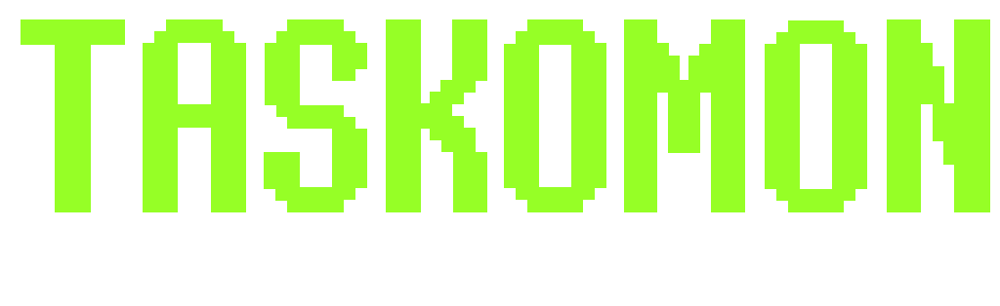
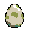
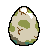
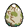
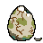
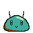
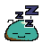
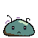

<p align="center">
  
</p>

<p align="center">
  <strong>No account. No cloud. No bullshit.<br>Just a tiny pixel-art pet that gets sick when you slack off.</strong>
</p>

<p align="center">
  <a href="https://voidz-ux.github.io/Taskomon/">
    
  </a>
  &nbsp;
  <a href="https://ko-fi.com/voidzsan">
    
  </a>
</p>

---

## What is this?

Taskomon is a free habit and task tracker where your consistency keeps a small pixel creature alive.

Hit your weekly goals → the Mon thrives. Miss them → it gets sick. Nail 100% → it turns golden.

No streaks gamification, no social features, no premium tier, no data leaving your phone. It's a weird little offline pet that reacts to your week.

---

## Your data never leaves your device

This is the thing that matters most, so here it is first:

- Everything is stored **locally on your device** — no server, no account, no sync
- **Export your entire history** as a JSON file at any time
- **Import it back** on any device, any browser, any time
- If you use this for two years and it disappears from the internet tomorrow, your data is still yours

> **Backup:** Profile screen → *Export backup* → save the file somewhere safe.  
> **Restore:** Profile screen → *Import backup* → pick your file. Done.

---

## The Mon

Your Mon starts as an egg. Crack progress appears as you build toward your first full week above threshold:

<p>
  
  &nbsp;
  
  &nbsp;
  
  &nbsp;
  
  &nbsp;
  
  &nbsp;
  
</p>

After your first full week above your chosen threshold, it hatches. Then it reacts to how you're doing:

| State | When |
|-------|------|
| 🥚 Egg | First week in progress |
| 😊 Healthy | Weekly completion ≥ your threshold |
| 💛 Golden | Hit 100% for the week |
| 😴 Sleepy | No activity for 3+ hours |
| 🤒 Ill | Week ended below threshold |

Complete a task and it animates immediately. Ignore it for a few hours and it falls asleep:

<p>
  
  &nbsp;&nbsp;&nbsp;
  
  &nbsp;&nbsp;&nbsp;
  
</p>

<sub>Sleepy after inactivity &nbsp;·&nbsp; Happy reaction on task completion &nbsp;·&nbsp; Ill after a bad week</sub>

---

## Three types of things

**Habits** — recurring goals with a weekly target (e.g. "run 3× a week"). They never expire and count toward your weekly percentage.

**Tasks** — one-off daily commitments with a due date. If you don't finish by day rollover, they carry over with a missed mark and affect your weekly completion rate.

**Pantry** — a no-pressure holding area. Items here have no due date and don't affect your score. When you're ready to commit, activate one and it becomes a task for today. 3-hour grace window to send it back if you change your mind.

---

## Install (no app store needed)

Taskomon is a PWA — installs directly from the browser.

**Android (Chrome):** open the link → menu → *Add to Home Screen*

**iPhone (Safari):** open the link → share icon → *Add to Home Screen*

**Desktop:** open in Chrome or Edge → install icon in the address bar

→ **[voidz-ux.github.io/Taskomon](https://voidz-ux.github.io/Taskomon/)**

---

## Everything else

- Offline-first — works with no internet after the first load
- 8 languages: EN, IT, ES, PT, FR, DE, ZH, JA
- Configurable threshold, day rollover hour (for night owls), week start day
- Calendar view — see your habits and tasks history across weeks, months, years
- No ads, no tracking, no telemetry. Ever.
- Free. Always.

---

## Privacy

No account. No login. No analytics. No network requests except loading the app itself. Your data is a JSON blob on your own device.

---

## Support

If Taskomon makes your days slightly more organized, a coffee is appreciated but never expected.

[](https://ko-fi.com/voidzsan)

---

## License

[CC BY-NC 4.0](LICENSE) — free to use, fork, and modify for non-commercial purposes.

---

## Run locally

```bash
git clone https://github.com/VOIDZ-ux/Taskomon.git
cd Taskomon
npm install
npm run dev
```

See [SETUP.md](SETUP.md) for Android/iOS build instructions.
